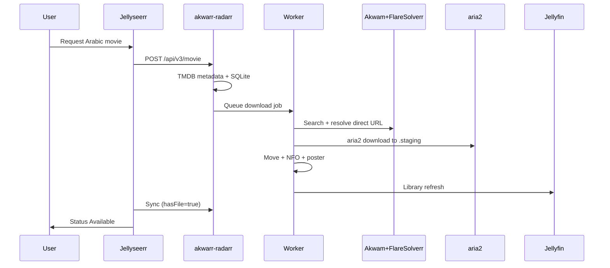

# Akwarr — Codex handoff & continuation guide

Use this document when picking up work in **Codex CLI**, **Codex app**, or **Terminal** (not Cursor agent sandbox). It summarizes the full project, homelab layout, deploy state, verification, and what to do next.

**Repo path (Mac):** `/Users/mikawi/Developer/akwarr`
**Remote path (CT107):** `/opt/akwarr`

---

## 1. What Akwarr is

Akwarr is a **Radarr/Sonarr API shim** for [Jellyseerr](https://github.com/Fallenbagel/jellyseerr). It lets users request **Arabic** movies and series without touching the existing English stack (Radarr, Sonarr, Prowlarr, Deluge).

```
Jellyseerr  →  Akwarr (Radarr :7879 / Sonarr :8990)
                    ↓
              Akwam.it + FlareSolverr + aria2
                    ↓
              /media/Movie/Arabic and /media/Serries/Arabic
                    ↓
              Jellyfin (same ZFS pool, CT113 at /cc/Movie/Arabic and /cc/Serries/Arabic)
```

**Design constraints:**

- English pipeline stays unchanged (torrents via Deluge, existing paths).
- Arabic pipeline uses **HTTP downloads** (aria2), not torrents.
- Jellyseerr discovery is **TMDB-only** — titles must exist on TMDB.
- Metadata: TMDB + NFO sidecars + optional Akwam poster/fanart for Jellyfin.

---

## 2. Homelab infrastructure

| LXC       | Hostname / SSH | IP           | Role                                                                        |
| --------- | -------------- | ------------ | --------------------------------------------------------------------------- |
| **CT107** | `ssh media`    | 192.168.1.25 | Docker: Jellyseerr, Radarr, Sonarr, Prowlarr, Deluge, Portainer, **Akwarr** |
| **CT113** | Jellyfin       | 192.168.1.20 | Jellyfin only                                                               |

**SSH config (`~/.ssh/config`):**

- `Host media` → `root@192.168.1.25` (LAN, direct)
- `Host prox` → Proxmox via Cloudflare Access (`ssh_prox.mikawi.org`) — fallback if LAN unavailable

**Shared ZFS:** `/mnt/pve/tv/Media`

| Container | Mount path |
| --------- | ---------- |
| CT107     | `/media`   |
| CT113     | `/cc`      |

Arabic content paths:

| CT107 (Docker)           | CT113 (Jellyfin)    |
| ------------------------ | ------------------- |
| `/media/Movie/Arabic`   | `/cc/Movie/Arabic` |
| `/media/Serries/Arabic`   | `/cc/Serries/Arabic` |
| `/media/Download/akwarr-staging` | (downloads only)    |

**Public URLs:**

- Jellyseerr: https://jellyseerr.mikawi.org
- Radarr (English): https://radarr.mikawi.org
- Sonarr (English): https://sonarr.mikawi.org

**LAN-only URLs:**

- Akwarr monitor/API: https://akwam.mikawi.org

**Existing English media paths (do not change):**

- Movies: `/media/Movie`
- Series: `/media/Serries` (typo preserved in live stack)
- Downloads: `/media/Download`

---

## 3. Repository layout

```
akwarr/
├── akwarr/                    # Python package
│   ├── api/radarr.py          # Radarr v3 shim (movies)
│   ├── api/sonarr.py          # Sonarr v3 shim (series)
│   ├── scraper/akwam.py       # Akwam search + link resolution
│   ├── scraper/elcinema.py    # Arabic title candidates for Akwam search
│   ├── scraper/flaresolverr.py
│   ├── download/aria2.py      # aria2 JSON-RPC client
│   ├── library/organizer.py   # Folder layout + file moves
│   ├── library/metadata.py    # NFO + artwork sidecars
│   ├── library/jellyfin.py    # Post-import library refresh
│   ├── core/store.py          # SQLite (movies, series, jobs)
│   ├── core/worker.py         # Background download/import loop
│   ├── core/tmdb.py           # TMDB lookup for Jellyseerr
│   └── main.py                # FastAPI entry (MODE=radarr|sonarr)
├── scripts/
│   ├── deploy-ct107.sh        # rsync Mac → CT107 + setup-homelab
│   ├── run-deploy-local.sh    # deploy + test + log to /tmp/akwarr-deploy.log
│   ├── setup-homelab.sh       # Runs on CT107: folders, .env, compose, Jellyseerr
│   ├── configure-jellyfin.sh  # Creates Arabic Movies/Series libraries via API
│   ├── test-homelab.sh        # Post-deploy smoke tests (7 checks)
│   └── publish-github.sh      # Git init + push (if needed)
├── docker-compose.yml         # Standalone stack (includes own FlareSolverr)
├── docker-compose.media-stack.yml  # Overlay: join media_network, reuse host /media
├── docs/
│   ├── ARCHITECTURE.md
│   ├── DEPLOYMENT.md
│   ├── JELLYSEERR.md
│   └── CODEX-HANDOFF.md       # ← this file
├── tests/                     # pytest (7 tests)
├── pyproject.toml
└── .env.example
```

**Stack:** Python 3.12, FastAPI, SQLite, Docker, uvicorn.

---

## 4. Docker services

| Container             | Port      | Purpose                             |
| --------------------- | --------- | ----------------------------------- |
| `akwarr-radarr`       | 7879      | Movies API shim                     |
| `akwarr-sonarr`       | 8990      | Series API shim                     |
| `akwarr-flaresolverr` | 8192→8191 | Cloudflare bypass (standalone mode) |
| `akwarr-aria2`        | 6800 RPC  | HTTP download queue                 |

On CT107, `docker-compose.media-stack.yml` attaches Radarr/Sonarr shims to **`media_network`** (or `media-stack_media_network`) so Jellyseerr can reach `akwarr-radarr:7879` and `akwarr-sonarr:8990`. FlareSolverr URL in overlay points at existing stack `flaresolverr:8191`.

**Compose on CT107:**

```bash
cd /opt/akwarr
export MEDIA_ROOT=/media
export COMPOSE_PROJECT_NAME=akwarr
docker compose -f docker-compose.yml -f docker-compose.media-stack.yml up -d --build
```

---

## 5. Environment variables

Secrets live in **`/opt/akwarr/.env`** on CT107 (written by `setup-homelab.sh`). Do **not** commit real keys to git.

For deploy from Mac, export these before running scripts (values are in your password manager / prior chat — copy from `/opt/akwarr/.env` on CT107 if unsure):

| Variable             | Purpose                                                       |
| -------------------- | ------------------------------------------------------------- |
| `AKWARR_API_KEY`     | X-Api-Key for Radarr/Sonarr shims + Jellyseerr Arabic servers |
| `TMDB_API_KEY`       | TMDB v3 API key (not JWT)                                     |
| `ELCINEMA_ENABLE`    | Enables ElCinema Arabic title bridge before Akwam search      |
| `ELCINEMA_BASE`      | Defaults to `https://elcinema.com`                            |
| `ARIA2_SECRET`       | aria2 JSON-RPC token; defaults to `P3TERX` for aria2-pro      |
| `JELLYFIN_URL`       | `http://192.168.1.20:8096`                                    |
| `JELLYFIN_API_KEY`   | Jellyfin API token                                            |
| `JELLYSEERR_API_KEY` | Jellyseerr settings API (base64-style key)                    |

Full list: see [`.env.example`](../.env.example).

---

## 6. Jellyseerr configuration (already done)

Arabic servers were added to Jellyseerr. English servers remain **default**.

### Radarr (Arabic)

| Field          | Value                  |
| -------------- | ---------------------- |
| Name           | Radarr (Arabic)        |
| Hostname       | `akwarr-radarr`        |
| Port           | `7879`                 |
| API Key        | `AKWARR_API_KEY`       |
| Root folder    | `/media/Movie/Arabic` |
| Profile        | Arabic 720p            |
| Default server | **No**                 |
| Sync enabled   | Yes                    |

**Required POST fields discovered during setup:** `activeProfileName`, `minimumAvailability`.

### Sonarr (Arabic)

| Field               | Value                  |
| ------------------- | ---------------------- |
| Name                | Sonarr (Arabic)        |
| Hostname            | `akwarr-sonarr`        |
| Port                | `8990`                 |
| Root folder         | `/media/Serries/Arabic` |
| enableSeasonFolders | `true`                 |
| Default server      | **No**                 |

Verify via API:

```bash
curl -sH "X-Api-Key: $JELLYSEERR_API_KEY" \
  https://jellyseerr.mikawi.org/api/v1/settings/radarr | jq .
curl -sH "X-Api-Key: $JELLYSEERR_API_KEY" \
  https://jellyseerr.mikawi.org/api/v1/settings/sonarr | jq .
```

More detail: [JELLYSEERR.md](./JELLYSEERR.md).

---

## 7. Jellyfin configuration

Run from Mac (needs LAN to CT113):

```bash
export JELLYFIN_URL='http://192.168.1.20:8096'
export JELLYFIN_API_KEY='...'
bash scripts/configure-jellyfin.sh
```

Creates:

| Library       | Type    | Path                |
| ------------- | ------- | ------------------- |
| Arabic Movies | movies  | `/cc/Movie/Arabic` |
| Arabic Series | tvshows | `/cc/Serries/Arabic` |

Recommended: metadata language **Arabic**, save artwork/metadata to media folders.

---

## 8. Deploy scripts (how to run)

### One-shot deploy + test (recommended)

From **Mac Terminal** or **Codex** (with full network — not Cursor agent):

```bash
cd /Users/mikawi/Developer/akwarr

export AKWARR_API_KEY='...'
export TMDB_API_KEY='...'
export JELLYFIN_URL='http://192.168.1.20:8096'
export JELLYFIN_API_KEY='...'
export JELLYSEERR_API_KEY='...'

bash scripts/run-deploy-local.sh
```

Log: `/tmp/akwarr-deploy.log`

### What deploy does

1. `deploy-ct107.sh` — rsync repo → `media:/opt/akwarr`
2. `setup-homelab.sh` on CT107:
   - Creates `/media/Movie/Arabic`, `/media/Serries/Arabic`, and `/media/Download/akwarr-staging`
   - Writes `/opt/akwarr/.env`
   - `docker compose ... up -d --build`
   - Registers Jellyseerr Arabic servers (skips if already present)
   - Runs `configure-jellyfin.sh` if Jellyfin reachable
3. `test-homelab.sh` — 7 automated checks

### Codex invocation example

```bash
cd ~/Developer/akwarr
codex exec -s danger-full-access --dangerously-bypass-approvals-and-sandbox \
  "Read docs/CODEX-HANDOFF.md. Export deploy env vars from /opt/akwarr/.env on media if needed. Run scripts/run-deploy-local.sh, then verify E2E per section 10. Report PASS/FAIL for each step."
```

**Note:** Codex fails inside Cursor agent (proxy blocks `chatgpt.com` WebSocket). Run Codex from Terminal or Codex app.

---

## 9. Current deployment status

Last Codex deploy session reported:

- `rsync` installed on `media`
- Containers up: `akwarr-radarr`, `akwarr-sonarr`, `akwarr-flaresolverr`, `akwarr-aria2`
- `test-homelab.sh`: **7 passed, 0 failed**
- Deploy hardening applied to: `setup-homelab.sh`, `configure-jellyfin.sh`, compose files, `DEPLOYMENT.md`

**You should re-verify** before assuming production-ready (see section 10).

---

## 10. Verification checklist

### Layer A — Automated smoke test

```bash
export AKWARR_API_KEY='...' JELLYSEERR_API_KEY='...' JELLYFIN_API_KEY='...'
bash scripts/test-homelab.sh
```

**Pass:** `RESULT: 11 passed, 0 failed`

| #   | Check                                                |
| --- | ---------------------------------------------------- |
| 1   | SSH to CT107                                         |
| 2   | `akwarr-radarr` + `akwarr-sonarr` containers running |
| 3   | Radarr API returns `Akwarr`                          |
| 4   | Sonarr API returns `Akwarr`                          |
| 5   | Root folder includes `/media/Movie/Arabic`           |
| 6   | `/media/Movie/Arabic` and `/media/Serries/Arabic` exist |
| 7   | Jellyfin API responds                                |
| 8   | Jellyfin Arabic libraries use `/cc/Movie/Arabic` and `/cc/Serries/Arabic` paths |
| 9   | Jellyseerr Radarr settings reference `akwarr-radarr` |
| 10  | Jellyseerr Sonarr settings reference `akwarr-sonarr` |
| 11  | TMDB lookup via Akwarr works                         |

Also verify Jellyseerr-compatible query auth and camel-case Servarr endpoints after deploy:

```bash
ssh media 'curl -sf "http://127.0.0.1:7879/api/v3/qualityProfile?apikey=$AKWARR_API_KEY"'
ssh media 'curl -sf "http://127.0.0.1:8990/api/v3/languageProfile?apikey=$AKWARR_API_KEY"'
ssh media 'curl -sf "http://127.0.0.1:7879/api/v3/queue?apikey=$AKWARR_API_KEY"'
ssh media 'curl -sf "http://127.0.0.1:8990/api/v3/queue?apikey=$AKWARR_API_KEY&includeEpisode=true"'
```

### Layer B — Jellyseerr connectivity (from inside Docker network)

```bash
ssh media 'docker exec jellyseerr curl -sf -H "X-Api-Key: YOUR_AKWARR_KEY" http://akwarr-radarr:7879/api/v3/system/status'
ssh media 'docker exec jellyseerr curl -sf -H "X-Api-Key: YOUR_AKWARR_KEY" http://akwarr-sonarr:8990/api/v3/system/status'
```

In Jellyseerr UI → Settings → Services → **Test** on both Arabic servers (must be green).

### Layer C — Jellyfin libraries

Dashboard → Libraries → confirm **Arabic Movies** and **Arabic Series** with correct `/cc/Movie/Arabic` and `/cc/Serries/Arabic` paths.

```bash
ssh media 'ls -la /media/Movie/Arabic /media/Serries/Arabic'
# On CT113:
ls -la /cc/Movie/Arabic /cc/Serries/Arabic
```

### Layer D — End-to-end download (real proof)

1. In Jellyseerr, request an **Arabic movie** (TMDB must have the title) → select **Radarr (Arabic)**.
2. Tail logs:
   ```bash
   ssh media 'docker logs -f akwarr-radarr'
   ssh media 'docker logs -f akwarr-aria2'
   ```
3. Confirm files:
   ```bash
   ssh media 'find /media/Movie/Arabic -type f \( -name "*.mkv" -o -name "movie.nfo" -o -name "poster.jpg" \) | head -20'
   ```
4. Jellyfin shows title with poster after library scan.
5. Jellyseerr request → **Available**.

### Layer E — English stack regression

Request an **English** title → must hit original Radarr/Sonarr, not Akwarr.

---

## 11. Request flow (for debugging)



---

## 12. Admin monitor UI

Akwarr serves an API-key protected monitor from both shim containers:

```bash
ssh media 'set -a; . /opt/akwarr/.env; set +a; echo "http://192.168.1.25:7879/ui?apikey=$AKWARR_API_KEY"'
ssh media 'set -a; . /opt/akwarr/.env; set +a; echo "http://192.168.1.25:8990/ui?apikey=$AKWARR_API_KEY"'
echo "https://akwam.mikawi.org/ui"
```

Use it to check:

- Akwam movie/series search results
- ElCinema Arabic title bridge for English Jellyseerr/TMDB names
- Akwam metadata, download links, and episode lists
- direct link resolution failures
- recent jobs, errors, active download percent, speed, and ETA
- imported files under `/media/Movie/Arabic` and `/media/Serries/Arabic`
- Jellyseerr-facing download ETA through `/api/v3/queue` on the Radarr/Sonarr shims; include both `timeleft` and future `estimatedCompletionTime`

Live CLI probes:

```bash
ssh media 'set -a; . /opt/akwarr/.env; set +a; curl -sf "http://127.0.0.1:7879/ui?apikey=$AKWARR_API_KEY" | grep -q "Akwarr Monitor"'
ssh media 'set -a; . /opt/akwarr/.env; set +a; curl -sf "http://127.0.0.1:7879/api/v3/monitor/jobs?apikey=$AKWARR_API_KEY" | python3 -m json.tool'
ssh media 'set -a; . /opt/akwarr/.env; set +a; curl -sf "http://127.0.0.1:7879/api/v3/monitor/files?apikey=$AKWARR_API_KEY" | python3 -m json.tool'
ssh media 'set -a; . /opt/akwarr/.env; set +a; curl -sf "http://127.0.0.1:7879/api/v3/queue?apikey=$AKWARR_API_KEY" | python3 -m json.tool'
ssh media 'set -a; . /opt/akwarr/.env; set +a; curl -sf "http://127.0.0.1:8990/api/v3/queue?apikey=$AKWARR_API_KEY&includeEpisode=true" | python3 -m json.tool'
```

External route:

- Nginx Proxy Manager CT100 proxy host `akwam.mikawi.org` -> `http://192.168.1.25:7879`
- Nginx Proxy Manager injects `X-Api-Key` for `akwam.mikawi.org`, so LAN URLs do not use `?apikey=...`.
- Pi-hole CT101 CNAME `akwam.mikawi.org,nginx.local`
- Akwarr API is included on the same LAN-only host, for example `https://akwam.mikawi.org/api/v3/system/status`
- Direct container access on `192.168.1.25:7879` and `:8990` still requires the normal API key.
- Cloudflare tunnel ingress for `akwam.mikawi.org` is intentionally absent and should match `http_status:404`.
- Cloudflare DNS has no `akwam.mikawi.org` record; public resolvers may show the old record briefly until cache expires.
- If new NPM hosts do not pick up after config writes, restart `openresty.service`; on 2026-05-31 it was still running a deleted OpenResty binary and reloads did not apply new SNI config until restart.

---

## 13. Troubleshooting

| Symptom                                   | Likely cause                      | Fix                                                                                    |
| ----------------------------------------- | --------------------------------- | -------------------------------------------------------------------------------------- |
| Jellyseerr can't connect to Arabic Radarr | Akwarr not on `media_network`     | `docker network inspect media_network`; redeploy with `docker-compose.media-stack.yml` |
| `Operation not permitted` SSH from Cursor | Cursor sandbox blocks LAN         | Use Terminal or Codex app                                                              |
| Codex stream disconnect 403               | Cursor proxy blocks chatgpt.com   | Run `codex exec` outside Cursor                                                        |
| Download never starts                     | FlareSolverr / Akwam scrape fail  | `docker logs akwarr-radarr`, `docker logs flaresolverr`                                |
| Download resolver returns Akwam shortener | Shortener page changed            | Check `a.download-link` / `/download/` extraction in `akwarr/scraper/akwam.py`          |
| aria2 returns 400 Unauthorized            | RPC token mismatch                | Ensure `ARIA2_SECRET=P3TERX` in `/opt/akwarr/.env` and shim containers                  |
| File on disk, Jellyfin empty              | Wrong library path or permissions | Verify `/cc/Movie/Arabic` and `/cc/Serries/Arabic`; `chown -R 1000:1000 /media/Movie/Arabic /media/Serries/Arabic` |
| Jellyseerr stuck Processing               | No TMDB match or worker stuck     | Check TMDB id; restart `akwarr-radarr`                                                 |
| Permission denied on CT107                | UID mismatch                      | Akwarr/aria2 run as PUID 1000; align with Jellyfin reader                              |

**Useful commands on CT107:**

```bash
docker ps --format 'table {{.Names}}\t{{.Status}}\t{{.Ports}}' | grep akwarr
docker logs --tail 100 akwarr-radarr
docker logs --tail 100 akwarr-sonarr
curl -sH "X-Api-Key: $AKWARR_API_KEY" http://127.0.0.1:7879/api/v3/system/status | jq .
curl -sH "X-Api-Key: $AKWARR_API_KEY" http://127.0.0.1:8990/api/v3/system/status | jq .
```

---

## 14. Development (local)

```bash
cd /Users/mikawi/Developer/akwarr
python -m venv .venv && source .venv/bin/activate
pip install -e ".[dev]"
pytest
ruff check akwarr tests
```

Run shims locally:

```bash
MODE=radarr DATA_PATH=./data/radarr akwarr-radarr   # :7879
MODE=sonarr DATA_PATH=./data/sonarr akwarr-sonarr   # :8990
```

---

## 15. Suggested next tasks for Codex

Pick based on what verification shows:

### If smoke tests pass but E2E never tested

- [ ] Run one Arabic movie request end-to-end
- [ ] Confirm Jellyfin library scan + poster
- [ ] Document any Akwam titles that fail scrape

### If Jellyfin libraries missing

- [ ] Run `scripts/configure-jellyfin.sh` from Mac
- [ ] Manually verify paths in Jellyfin UI

### If Jellyseerr Advanced Requests not enabled

- [ ] Enable **Advanced Request** permission for users who need Arabic server picker
- [ ] Optional: override rule `original_language = ar` → Arabic servers

### Hardening / polish

- [ ] Push repo to GitHub (`Hassan220022/akwarr`) via `scripts/publish-github.sh`
- [ ] Add Cloudflare SSH tunnel for `media` (like `prox`) so remote agents can deploy
- [ ] Monitor disk usage on `/media/Download/akwarr-staging`
- [ ] Series E2E test (Sonarr Arabic + season folder layout)

### Known limitations (document, don't "fix" blindly)

- Jellyseerr only discovers TMDB titles
- ElCinema bridge improves Arabic Akwam matching, but still starts from Jellyseerr/TMDB requests
- Akwam availability varies; FlareSolverr required
- English stack intentionally separate (no shared Radarr instance)

---

## 16. Related docs

| Doc                                  | Contents                      |
| ------------------------------------ | ----------------------------- |
| [README.md](../README.md)            | Quick start, feature summary  |
| [ARCHITECTURE.md](./ARCHITECTURE.md) | Module map, data flow         |
| [DEPLOYMENT.md](./DEPLOYMENT.md)     | Proxmox-specific deploy steps |
| [JELLYSEERR.md](./JELLYSEERR.md)     | Jellyseerr server settings    |

---

## 17. Codex prompt template (copy-paste)

```
You are continuing work on Akwarr at /Users/mikawi/Developer/akwarr.

Read docs/CODEX-HANDOFF.md first.

Homelab: CT107 (ssh media, 192.168.1.25) runs Docker media stack.
CT113 (192.168.1.20) runs Jellyfin. Shared ZFS: /media on CT107, /cc on CT113.

Goals:
1. Verify deploy: bash scripts/test-homelab.sh (must be 7/7 pass)
2. If fail: fix and redeploy via scripts/run-deploy-local.sh
3. Run E2E: one Arabic movie request via Jellyseerr → file on disk → Jellyfin → Available
4. Report exact commands, outputs, and PASS/FAIL checklist from section 10

Secrets: read from /opt/akwarr/.env on CT107 or ask me to export AKWARR_API_KEY, TMDB_API_KEY, JELLYFIN_API_KEY, JELLYSEERR_API_KEY.

Do not modify English Radarr/Sonarr/Deluge configuration.
Use -s danger-full-access for SSH and LAN access.
```

---

_Last updated: 2026-05-31 — after initial homelab deploy and Jellyseerr Arabic server setup._
